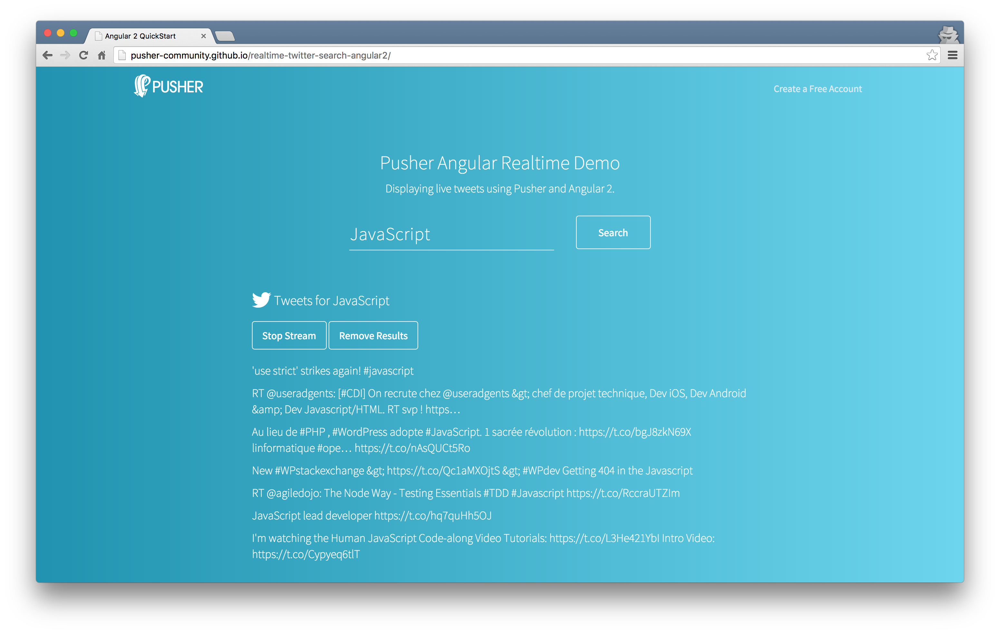

# Angular 2 and Pusher

A client of the [Pusher Datasource API](https://github.com/pusher-community/pusher-datasource-api) that lets you search for tweets and view the results in realtime.

;

## Running

```
$ npm install
```

You need to run two processes separately. The first will compile your TypeScript:

```
$ npm run tsc
```

To run the app locally with live reload enabled, use `npm start`:

```
$ npm start
```

This will run the app on port 8080 and open a new browser tab.
